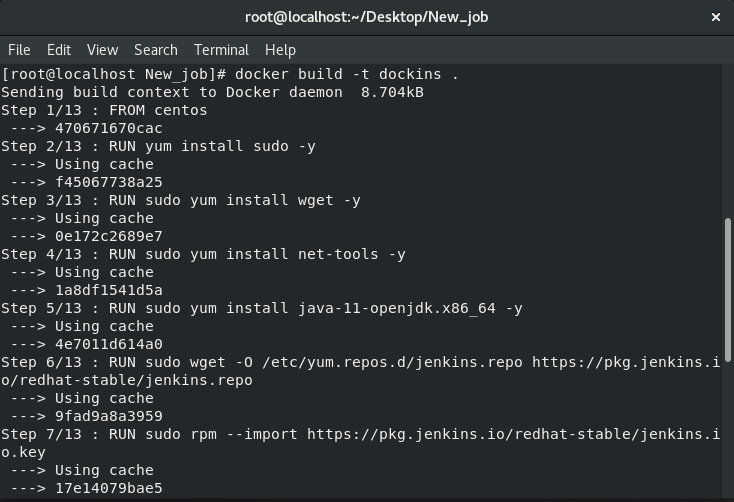

Hello There,

I am Shoumik Sahu and I was given the task to create an Automation system that will perform the following tasks shown below.

I  have tried my best to explain each and every step done to make the project...

1. I created a folder in my BaseOS(Redhat Linux 8) :
    mkdir /root/shoumik
    cd /root/shoumik
2.  We were supposed to do the tasks given by vimal daga sir:

<h1><b>First Task</b></h1>
1st Task was to create an image that will have jenkins installed in it...

1. First we need to create the docker file

2. Write these in the Dockerfile

3.After creating the Dockerfile we need to build the image:

I used:

Here I used the "." to point to the current directory to find the Dockerfile

And then run it:

After the build is done....Our 1st Task is completed with the creation of image

<h1><b>Second Task</b></h1>

2nd task was when the image was used to make the container, then the jenkins should automatically launch.

**NOTE:**
I am assuming that you already know how to setup Jenkins and also how to install the plugins....

1. Run the container...
    
    

