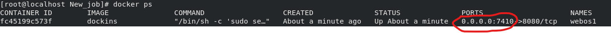

Hello There,

I am Shoumik Sahu and I was given the task to create an Automation system that will perform the following tasks shown below.

I  have tried my best to explain each and every step done to make the project...

1. I created a folder in my BaseOS(Redhat Linux 8) :
    mkdir /root/shoumik
    
    cd /root/shoumik
    
2.  We were supposed to do the tasks given by vimal daga sir:

<h1><b>First Task</b></h1>
1st Task was to create an image that will have jenkins installed in it...

1. First we need to create the docker file

2. Write these in the Dockerfile

3.After creating the Dockerfile we need to build the image:

I used:

Here the "." is used to point to the current directory to find the Dockerfile

And then run it:

After the build is done....Our 1st Task is completed with the creation of image

<h1><b>Second Task</b></h1>

2nd task was when the image was used to make the container, then the jenkins should automatically launch.

**NOTE:**
I am assuming that you already know how to setup Jenkins and also how to install the plugins and also have a basic idea to use the Jenkins....

1. Run the container...
    
    
    
  Here i used the -p to allocate a particular BaseOS port to 8080 port(jenkins running port)
 
   After running this will be the output:

2. Now press ctrl+shift+N to open a new terminal to the BaseOS and type:

The output should be like:

There you can see what is  the IP with port to launch jenkins

3. Just copy the IP:

4. And paste it in your web browser:

This will simply start the docker...

<h1><b>Third Task</b></h1>

This part of the task was supposed to be having jobs in Jenkins:

<h2>1st job:</h2>

The 1st job was supposed to copy all the contents of the Github Repo to a folder in the container created....

1. First aquire the link to your repository and paste it :

Here

and

Here

2. You can use either Tokens or Webhook to trigger the job:

3. Next in the job1 just build an execute shell to write commands to copy files from GitHub repo to your local system folder:

4. Click on Apply to save and then click on Save to exit Job1

<h2>2nd Job:</h2>

The 2nd job was supposed to copy the content present in the local folder of the Container to the BaseOS folder:

1. For this job we can directly skip to Build Triggers:

2. Need to build the execute shell to copy files from Container OS folder to BaseOS folder:

I used scp to copy files without anyone inconvinience and also without any tunnel of any sorts...

<h2>3rd Job</h2>

This job is to detect the type of file and based on that run a docker image for it :

----To do this we need to create a ssh-keygen to avoid everytime authentication----

1. Here also we can directly skip to Build Triggers:

2. Here also we need to build the Execute shell and write the following:

<h2>4th Job</h2>

This job is supposed to check if the app or program uploaded by the developer is working properly or not...if not then we need the job to send an email to the developer:

1. Here also we need to start with Build Triggers:

2. Then we need to again build the Execute shell..

Here if the status is 200 means that the site is working...incase it doesn't works it means that the command returned 500 which means failed...

exit 0: It represents that the job is <em>successful</em>

exit 1: It represents that the job is <em>not successful</em>

3. Here I used this option beacuse the next job should be triggered if there is an error in the build:

4. If the build fails then we need to send an Email to the developer:

**NOTE**

For the Email service to work...we need to setup the SMTP server:

First go to Jenkins DashBoard->Manage Jenkins->Configure System:

Here scroll down to E-mail Notification...

And fill up the boxes as shown:

Check if you get an email by  doing the Test configuration option...but if it doesn't work...

Then,

Go to your terminal of the container

And write the following:

Hit  'I' to enter insert mode and move down to change the following: 

.png

Now press Esc and type ":wq" to exit vi

and with this the smtp should work just fine

<h2>5th Task</h2>

This was a task that is the app or program fails to run then it should restart the container :

1. We can directly skip to the Post-build section and...

This will just restart the container..

<h1>Congratulations</h1>

<h3>With this the Automated server is up and running to be used....host files or webpages and it will automatic deploy the program to the server...</h3>

In case of any problem or query just Direct Message(DM) me on my Linkedin Profile:

https://www.linkedin.com/in/shoumik-sahu-3b5631188

Thank You.
  

    

